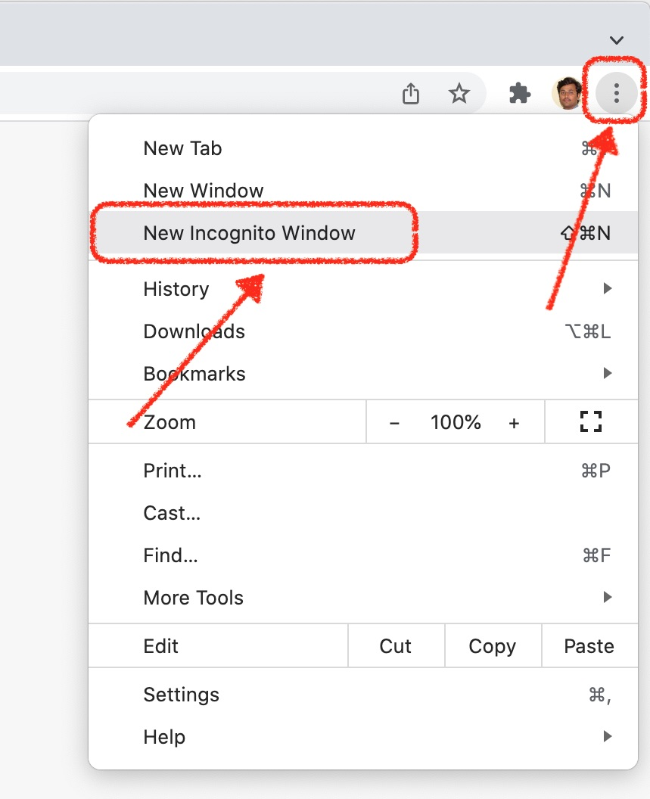
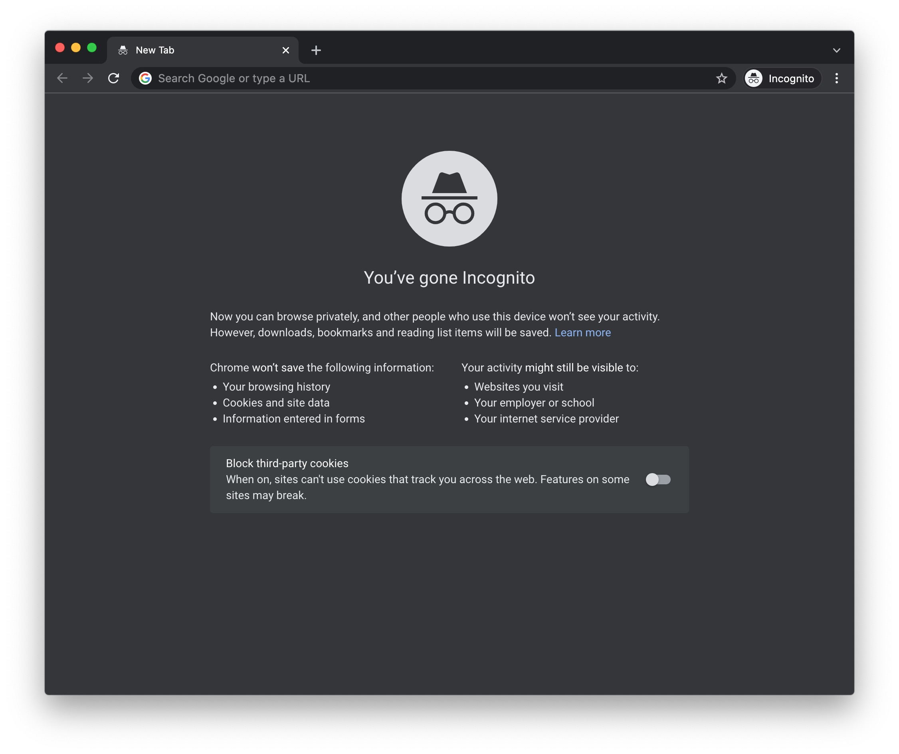
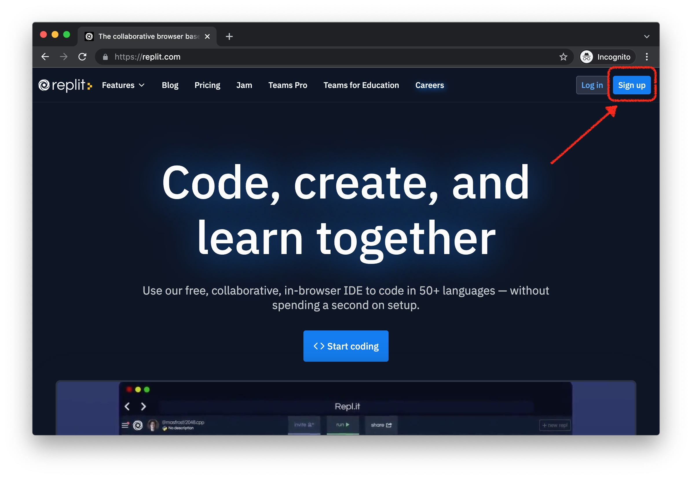
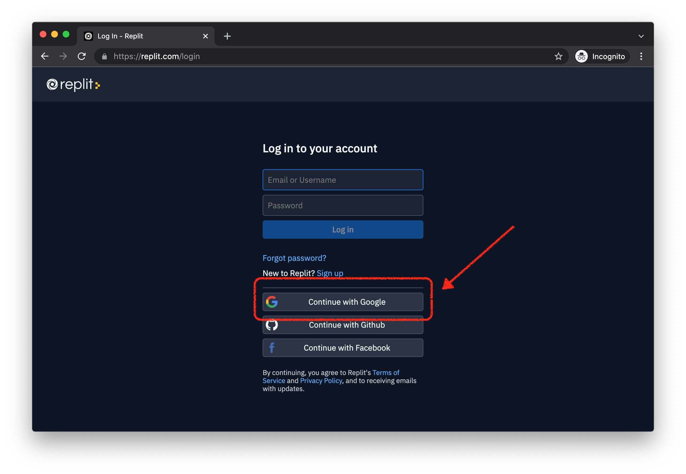
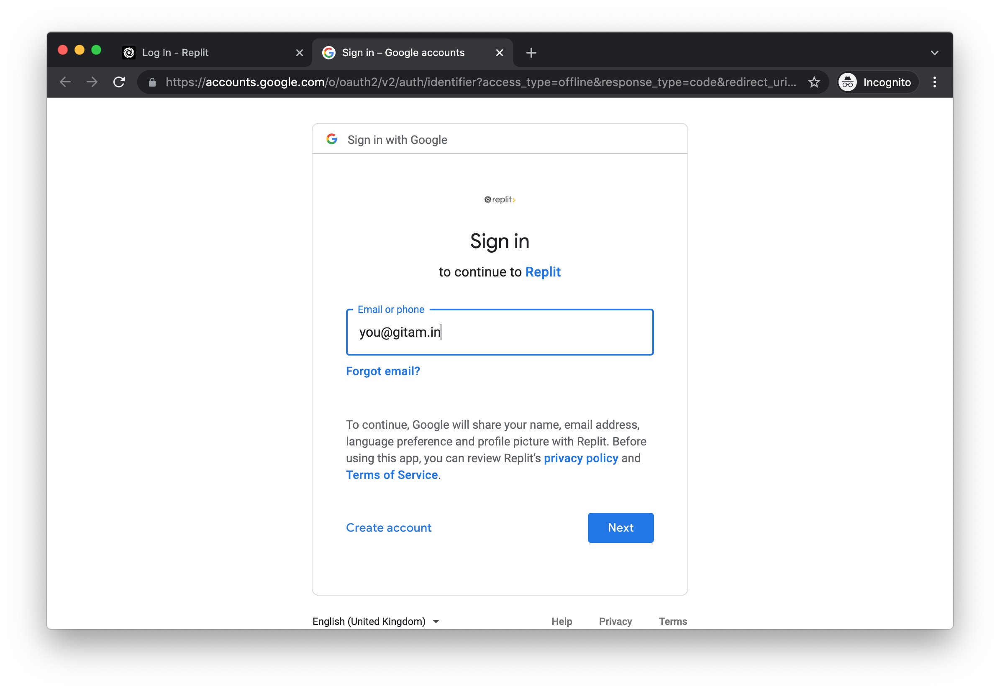

1. Open New Incoginito Window in Google Chrome browser.

It will look like this. 

2. Click Sign-up

3. Click Continue-with-Google

4. Enter your Gitam email id

5. Continue with the reamaining steps and complete the Sign up process.