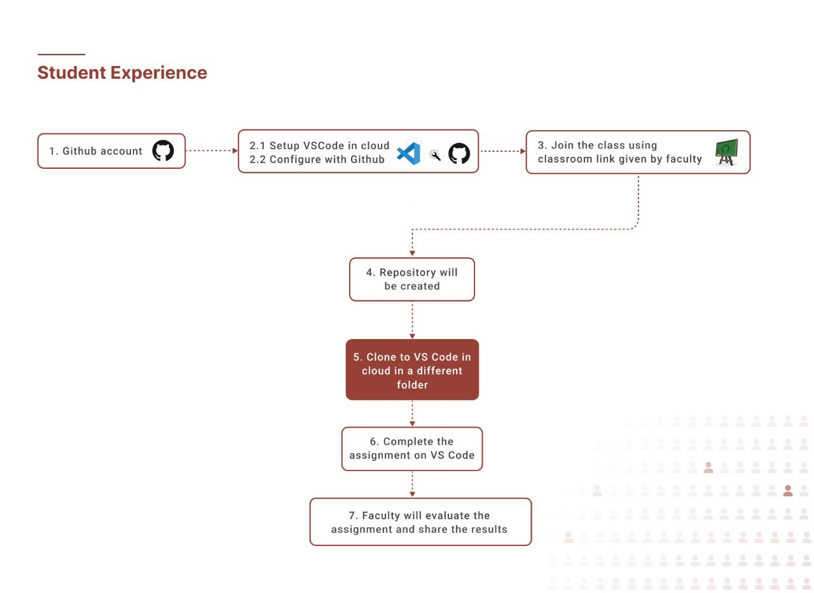
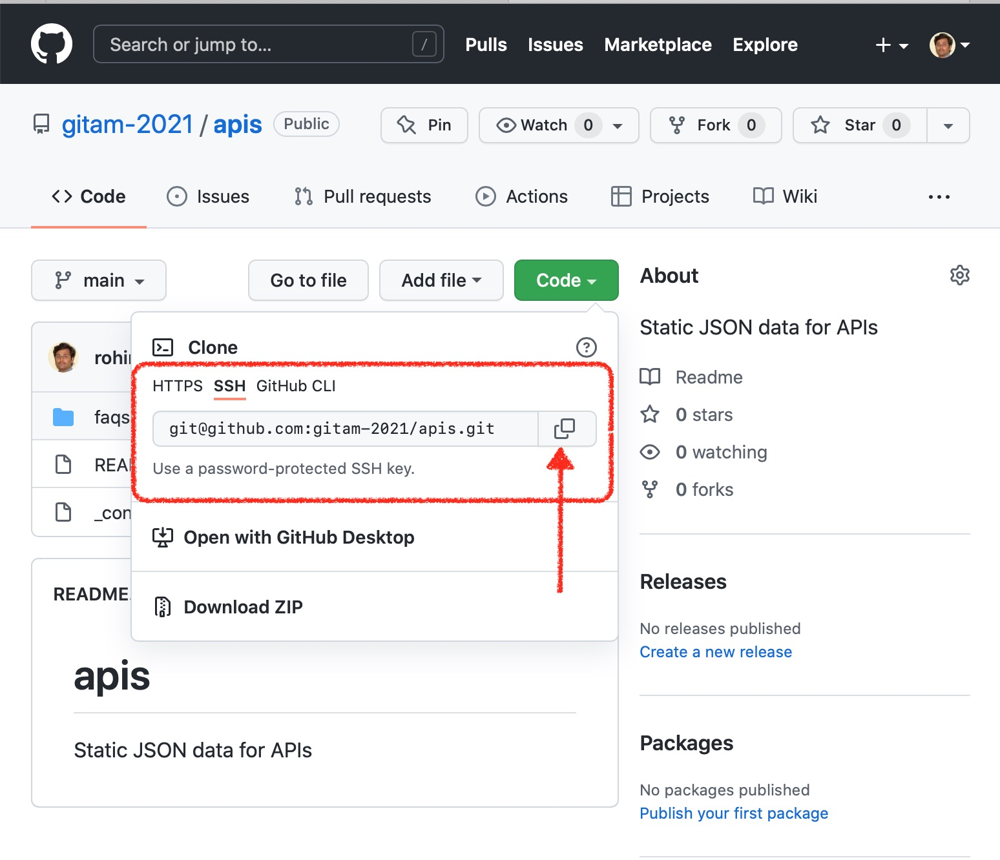

# How to submit your first assignment?


## Steps
1. Login to Github.
2. Create a Dev machine in the cloud. Configure Github SSH with your Dev machine in the Cloud. Select the `GITAM` folder.
3. Accept the assignment.
4. Working on the assignment. 
5. Submitting your assignment.

### Step#1: Login to Github
[Login](https://github.com/login) to your github account.

### Step#2.1: Create a Dev machine in cloud
Login via your Github account at [https://code.cs50.io](https://code.cs50.io).  
VSCode interface will be shown after it creates a Dev machine in the cloud.

### Step#2.2: Configure Github SSH with your Dev machine in the cloud

<iframe width="560" height="315" src="https://www.youtube.com/embed/k57pr3mpLFc" title="YouTube video player" frameborder="0" allow="accelerometer; autoplay; clipboard-write; encrypted-media; gyroscope; picture-in-picture" allowfullscreen></iframe>

1. Open a terminal window, if not open already, within [Visual Studio Code](https://cs50.readthedocs.io/code/).
2. Execute `ssh-keygen`. When prompted to "save the key," just hit Enter, without typing anything.
3. You'll then be prompted for a "passphrase" (i.e., password). No need to input a passphrase; just hit Enter. You'll then see a "randomart image" that you can ignore.
4. Execute `cat ~/.ssh/id_rsa.pub`. You'll then see your "public key," multiple lines of seemingly random text. Highlight and copy all of those lines, starting with `ssh-rsa` to the end. **But don't highlight your terminal window's prompts (which contain `$`) before or after those lines.**
5. Visit [https://github.com/settings/keys](https://github.com/settings/keys), logging in with your GitHub username and password as usual.
6. Click **New SSH Key**.
7. Paste your public key into the text box under **Key**. Optionally input a title under **Title** (e.g., `VSCode in Cloud`).
8. Click **Add SSH Key**.
9. Execute `ssh -T git@ssh.github.com -p 443`.  You should be greeted with "Hi USERNAME! You've successfully authenticated, but GitHub does not provide shell access."  If you don't see that, review the above steps to verify you didn't skip something.

### Step#2.3: Configure GITAM folder and open it
1. Open a terminal window, if not open already, within [Visual Studio Code](https://cs50.readthedocs.io/code/).
2. Execute the following 2 commands to create a `GITAM` folder inside `/workspaces` folder.
    ```bash
    cd /workspaces/
    mkdir GITAM
    ```
3. Using VScode Menu click `File -> Open Folder...` and select the `GITAM` folder. You can see [demo video](assets/00-vscode-gitam.mp4).

### Step#3: Accept the assignment
Open the link for the assignmnet given by your teacher. Accept the assignment. An `assignment repository` will be created for you.


### Step#4: Working on the assignment
1. Go to your assignment repository and copy the clone URL. Here is an example. You need to use your assignment repository. 
   
2. Open a terminal window, if not open already, within [Visual Studio Code](https://cs50.readthedocs.io/code/).
In the terminal if not already in `GITAM` folder, change directory to `GITAM`. Inside that type the following command.
    ```bash
    git clone <assignment-repository-url>
    ```
3. A folder will be created with the files of the assignment. Now expand the folder in the VSCode Explorer and start working on the code just like in the REPLIT editor.

### Step#5: Submitting your assignment
You don't need to do anything. Just compelete the assignment. Once the due date is completed, you updated assignment code snapshot will be taken and will be evaluated.


## Vocabulary
1. [Git](https://git-scm.com) is a popular tool for saving different versions of code.
2. [GitHub](https://github.com/), a popular website for saving those versions in the cloud.
3. [VSCode](https://code.visualstudio.com) is an Integrated Development Environment(IDE).
